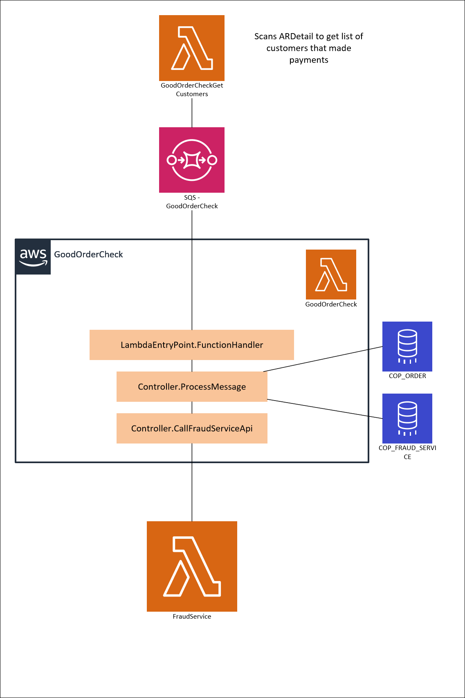

# GoodOrderCheck 

## Overview

GoodOrderCheckGetCustomers will query **AR_DETAIL** table and get a list of customers that made payments the day before it runs. Runs daily at 10AM and kicked off by Automic. 
GoodOrderCheck Lambda will take in a customer number and company code from an SQS. Will query COP_ORDER and return all the orders that the customer has ever made for that company.

ProcessMessage controller will then query **COP_FRAUDSERVICE** and check the **DECISION_ON_SIFT** column. If this column has not already been set with a value (hasn't already been marked good), it'll call FraudService API with 'LegitOrder' call type. FraudSerivce will then update the order as being good. 

## Diagram 

## TroubleShooting