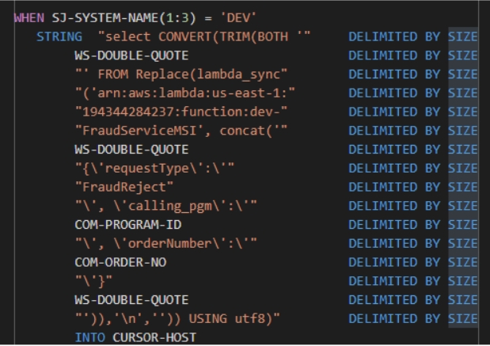

# FraudServiceMSI

## Description: 

This API was created to be utilized by the online screens **CSR (COL341)** and Authorization work **(COL458)** to invoke the Fraud Service Lambda via a MySQL call. The batch program to process letters and audits **(COP435)** also calls the service. The service simply takes in a Fraud Service request and passes it along to the Fraud Service Lambda via the API Gateway for processing. This service was set up in such a way because the Fraud Service Lambda call only be triggered from the API Gateway. AWS Lambdas are limited to one event and a setting up a generic event to handle multiple events is not easily done.

## Code and Repo: 

Lives under the Fraud Repo.

## Sample Request:
```
SELECT 
lambda_sync( 'arn:aws:lambda:us-east-1:194344284237:function:dev-FraudServiceMSI', 
concat('"{\'requestType\':\'', 'fraudreject', '\',\'calling_pgm\':\'', 'COL341', '\',\'orderNumber\':\'', '87649839' ,'\'}"'));
```

## Sample Response: 
Response returns to the database as a JSON object in a BLOB

```
{
	"status": "93",
	"statusMessage": "Error in Kount: No valid Kount data found on database.",
	"outOfWalletFlag": "N"
}
```

## Cobol Code: 

