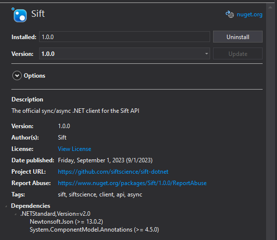

# Sift

## Sift Status

[Official Sift Health Dashboard](https://status.sift.com/)

## Sift Nuget Package

We use the official Sift nuget package to interact with Sift api.

[Github documentation for .net version of nuget package.](https://github.com/siftscience/sift-dotnet)

[Official documentation for the sift api.](https://sift.com/developers/docs/java/apis-overview)

Official Nuget Package:

