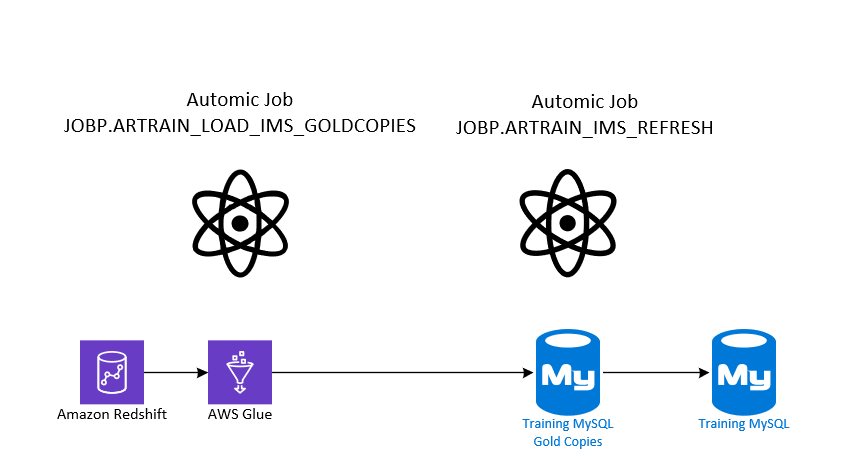

# IMS Pega Training Data Refresh

## Overview

This project copies production data from Redshift over to the MySQL training environment. The purpose is to provide phone agents and operators with a consistent set of customer data for training purposes. The process uses several glue jobs and is automated using a couple automic schedules controlled by the AR team.

The process consists of 5 Glue Jobs.

## Glue Jobs, Tables and Resources

|Glue Job | MySqlTables | Redshift |
|---------|--------|--------|
|env-CrdTrainingImsCusEmailExtract | IMS_CUS_EMAIL | oframe_prd_s.ims_cus_email |
|env-dev-CrdTrainingImsMasonCrnExtract | IMS_MASON_CRN | oframe_cdc_prd_s.ims_mason_crn |
|env-CrdTrainingMasonPreferencesExtract| IMS_MASON_PREFERENCES | oframe_prd_s.ims_mason_preferences |
|env-CrdTrainingOrderAuthExtract | IMS_AUTH, IMS_ORDER | oframe_prd_s.ims_order, oframe_prd_s.ims_auth |
|env-CrdTrainingImsCustomerExtract| IMS_CUSTOMER | oframe_prd_s.ims_customer |

The 'Gold Copy' MySql tables are preceded with a GC_. The Following are the 'Gold Copy' Tables:
- GC_IMS_AUTH
- GC_IMS_CUS_EMAIL
- GC_IMS_CUSTOMER
- GC_IMS_MASON_CRN
- GC_IMS_MASON_PREFERENCES
- GC_IMS_ORDER

## Automic Jobs
This process is controlled by two Automic schedules:

1.  `JOBP.ARTRAIN_LOAD_IMS_GOLDCOPIES`: This schedule kicks off the 5 Credit glue jobs. These jobs pull new and updated production customer data from Redshift change-data-capture tables and loads it into the MySQL training "gold copy" tables.

2.  `JOBP.ARTRAIN_IMS_REFRESH`: This schedule kicks-off a static load Glue jobs owned entirely by AR. These jobs copy data from the MySQL training "gold copy" tables into the main training tables. It runs much more frequently, multiple times per day, to reset the training data.

*Note*: The `JOBP.ARTRAIN_LOAD_IMS_GOLDCOPIES` schedule runs less often, only when new customers need to be added or existing customer data needs to be modified in the training environment.

*Note*: The Glue Jobs owned by Credit are only run by the first Automic schedule, `JOBP.ARTRAIN_LOAD_IMS_GOLDCOPIES`. The second Automic Schedule only calls the static load Glue job which is entirely owned by AR.  



## Static Load Table

The AR team utilizes an AWS Glue job named `env-ARTrainingTableLoad`. This job is designed to transfer data from one MySQL table to another without making any modifications to the data. Essentially, it performs a one-to-one copy operation. 

The source (from) and destination (to) table names are provided as environmental variable arguments when running the Glue job. This job is primarily used to replicate the 'gold copy' tables (the original, unmodified tables) to the main tables that the Pega operators work with.

It allows operators or agents to train, make changes and experiment with the data without affecting the 'gold copy' tables. Once the training session is complete, the environment can be quickly reset to its original state (using the 'gold copy' tables) in preparation for the next batch of trainees.

**Note**: The management and control of this Glue job falls under the responsibility of the AR team, not the Credit team.

## Adding New Customers

The AWS Glue jobs are designed to fetch a list of customer scenarios from a file stored in an S3 bucket named `env-training-scenarios-colonybrands-east1`. These customer scenarios are specifically chosen by the phone operators teams for training purposes. 

In addition to the customer data, a specific date is also passed into the Glue Job. This date is used to ensure that the Change Data Capture (CDC) data being retrieved corresponds to the same date.

Any customer on the file will be added to the 'gold copy', but not removed. For instance, let's consider a scenario where the job is run twice. During the first run, the input file contains 10 customer numbers. These customers are added to the 'gold copy' tables. Now, for the second run, the input file has been updated and contains 8 different customers. After the second run, the 'gold copy' tables will contain data for a total of 18 customers (10 from the first run and 8 from the second run).

The structure of the customer file is straightforward and might look something like this:


# Anonymizing Customer Data in Glue Jobs

Two of our AWS Glue jobs, `env-CrdTrainingImsCustomerExtract` and `env-CrdTrainingImsCusEmailExtract`, anonymize sensitive customer data. This is done to protect customer privacy and comply with data protection regulations.

The anonymization of customer names in our system is based on the **last four digits** of the customer number. This process is important to understand as it directly impacts the resulting anonymized names.

The first and last names are selected from a predefined list of 100 names, indexed from 0 to 99. The selection of these names is based on the last four digits of the customer number.

Here's how it works:

1. The first name is selected based on the last two digits of the customer number. For example, if the last two digits are '92', the first name will be the 92nd name in the list (remember, the list is 0-indexed).

2. The last name is selected based on the second to last two digits of the customer number.

It's important to note that the order of names in the list is crucial for this process to work correctly.

List of first and last names used. 

```
fnames = ["Alice", "Bob", "Charlie", "Dave", "Eve", "Frank", "Grace", "Heidi", "Ivan", "Judy", "Karl", "Liam", "Mallory", "Nina", "Oscar", "Pat", "Quincy", "Rupert", "Sybil", "Trudy", "Ursula", "Victor", "Walter", "Xena", "Yanni", "Zelda", "Aaron", "Beth", "Caleb", "Diana", "Elijah", "Fiona", "Gabe", "Hannah", "Isaac", "Jasmine", "Kyle", "Laura", "Mason", "Natalie", "Oliver", "Paige", "Quinn", "Rachel", "Sam", "Tina", "Ulysses", "Violet", "William", "Xander", "Yara", "Zane", "Amy", "Blake", "Clara", "Derek", "Emma", "Felix", "Gina", "Henry", "Isla", "Jack", "Katie", "Luke", "Mia", "Noah", "Olivia", "Peter", "Quincy", "Rosa", "Steve", "Tara", "Uma", "Vince", "Wendy", "Xavier", "Yvonne", "Zack", "Alex", "Bella", "Carlos", "Dani", "Ethan", "Faye", "George", "Holly", "Ian", "Jill", "Ken", "Lily", "Max", "Nora", "Owen", "Polly", "Quentin", "Rita", "Sean", "Tess", "Una", "Vern", "Wanda", "Xerxes", "Yolanda", "Zeke"]

lnames = ["Anderson", "Brown", "Carter", "Davis", "Evans", "Fisher", "Garcia", "Harris", "Iverson", "Johnson", "King", "Lewis", "Miller", "Nelson", "Owens", "Parker", "Quinn", "Robinson", "Smith", "Taylor", "Underwood", "Vaughn", "Williams", "Xavier", "Young", "Zimmerman", "Adams", "Baker", "Clark", "Drake", "Edwards", "Franklin", "Grant", "Hawkins", "Ingram", "Jackson", "Knight", "Lloyd", "Morgan", "Norton", "Olson", "Peterson", "Quinn", "Russell", "Stevens", "Turner", "Upton", "Vincent", "Watson", "Xanders", "York", "Zimmer", "Allison", "Boyd", "Chapman", "Dunn", "Ellis", "Fowler", "Griffin", "Hunt", "Irwin", "James", "Kelley", "Lawson", "Myers", "Norman", "O'Neil", "Patterson", "Quincy", "Reed", "Simpson", "Travis", "Underhill", "Vance", "Wallace", "Xiong", "Yates", "Zane", "Arnold", "Blake", "Caldwell", "Dixon", "Emerson", "Freeman", "Glover", "Henderson", "Irving", "Jennings", "Kennedy", "Lambert", "Murphy", "Nolan", "Osborne", "Payne", "Quigley", "Riley", "Sanders", "Thompson", "Upshaw", "Vega", "Webb", "Xu", "Young", "Zavala"]
```


