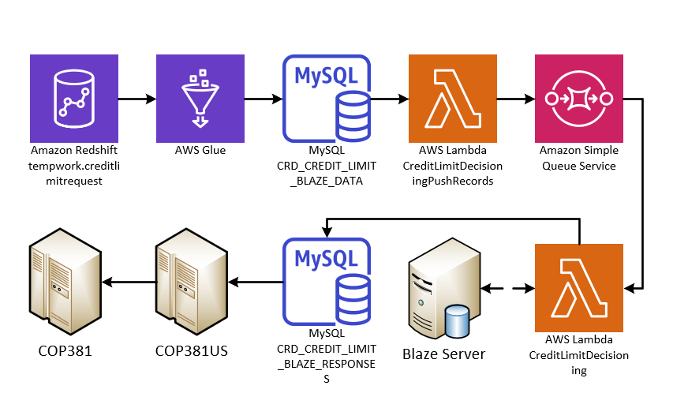

# CreditLimitDecisioning

## Overview

The credit limit decisioning process determines if a customer's credit limit can be increased. The entire process is controlled with an Automic schedule called <font color="#51c84d">**CREDIT_BLAZE_LIMITS**</font>. It starts by kicking off a series of data warehouse jobs. These jobs compile relevant customer data into a Redshift table called <font color="#c84d51">**tempwork.creditlimitrequest**</font>.

Next, an AWS Glue job named <font color="#ac47ca">**{env}-CreditLimitDecisioningGlueJob**</font> copies the customer records from the Redshift table into a MySQL table called <font color="red">**CRD_CREDIT_LIMIT_BLAZE_DATA**</font>.

The **Lambda function process** retrieves the customer data from the MySQL table and feeds it into the Blaze rules engine, which contains the logic around credit limits. The output of the Blaze rules engine is saved into the <font color="red">**CRD_CREDIT_LIMIT_BLAZE_RESPONSES**</font> Table.

Finally, these blaze response records are picked up by **COP381US**. This COBOL program creates an input file for the normal **COP381** program, which will pick up the file and update the customers credit limits. 



## **Lambda Function Process Overview**

| | **dev** | **uat** | **prd** |
|-|-----|-----|-----|
|**Lambda 1** | dev-CreditLimitDecisioningPushRecords | uat-CreditLimitDecisioningPushRecords | prd-CreditLimitDecisioningPushRecords |
|**Lambda 2** | dev-CreditLimitDecisioning| uat-CreditLimitDecisioning | prd-CreditLimitDecisioning |

This process relies on two AWS Lambda functions and an SQS queue to process customer records through Blaze Rules Engine.

The Automic schedule will spin up nine <font color="orange">**{env}-CreditLimitDecisioningPushRecords**</font> Lambda executions. These lambdas, running concurrently, pull data from <font color="red">**CRD_CREDIT_LIMIT_BLAZE_DATA**</font> table. Each Lambda is assigned a number from 1 to 9. When invoked, the Lambdas will only query records where the <font color="#ca4765">**LAMBDA_NUMBER**</font> column value matches their assigned number. This strategy allows the large volume of customer records to be divided into manageable batches across each lambda execution. This parallelizes the processing. The <font color="orange">**{env}-CreditLimitDecisioningPushRecords**</font> Lambda also checks the  <font color="#ca4765">**PROCESSED_STATUS**</font> column. If this column is empty or null, it means the record has not yet been processed. If it contains **'Y'**, the record has already been processed. The loader lambda will only retrieve records not yet processed. After each <font color="orange">**{env}-CreditLimitDecisioningPushRecords**</font> Lambda queried it's data subset, it loads that data into an AWS sqs.The data, called messages, are loaded into an SQS queue called <font color="  #4eb8be  ">**{env}-CreditLimitDecisioning**</font>.

<font color="red">**Important**</font>: *The loader uses a fire-and-forget system. It does not check the response after sending a request to load messages into the queue. Messages can fail to load. If this occurs, the queue should be purged and the records reloaded.*

The queue holds these messages until they are processed. When the trigger is enabled on the <font color="orange">**{env}-CreditLimitDecisioning**</font> Lambda function, it will retrieve messages from the queue. These messages include SequenceIdkey numbers. The program takes that unique key and queries the customer data from the <font color="red">**CRD_CREDIT_LIMIT_BLAZE_DATA**</font> MySQL table. It then formats that data into an XML SOAP request. Using SOAP, a request is made to the Blaze Server. The program receives an XML response from Blaze, which it reformats and saves into the <font color="red">**CRD_CREDIT_LIMIT_BLAZE_RESPONSES**</font> MySQL table.

If a message is processed successfully, it is deleted from the queue. If a message fails processing, it goes back to the queue to be reprocessed. If a message continues failing after multiple attempts, it is sent to the <font color="  #4eb8be  ">**{env}-CreditLimitDecisioningDeadLetter**</font> queue. In the deadletter queue, failed messages sit until purged. Developers can pull records from the deadletter queue through the AWS console to investigate why the messages failed.

The <font color="orange">**{env}-CreditLimitDecisioning**</font> Lambda function that processes messages from the SQS queue can scale up dynamically based on demand. The maximum concurrency (max number of simultaneous Lambda executions) is configured in Terraform. 

This allows the processing capacity to increase exponentially. When the Lambda is triggered, it will launch up to the max concurrent executions if needed, each of which retrieves messages from the queue in batches and processes them. For example if the Max Concurrency is set to 75, a max of 75 lambda executions will work in parallel to process messages in the queue. 

The batching window, batch size, and other parameters that control the throughput and parallelism of the Lambdas are also configurable in the Terraform resource block. For example:


```terraform
resource "aws_lambda_event_source_mapping" "sqstrigger-east1" {
  provider          = aws.east1
  event_source_arn  = aws_sqs_queue.main-queue-east1.arn
  function_name     = module.lambda_alias-east1-main.lambda_alias_arn
  function_response_types = ["ReportBatchItemFailures"]
  maximum_batching_window_in_seconds = 300
  batch_size = 1000
  scaling_config {
    maximum_concurrency = 75
  }
  depends_on = [
    aws_sqs_queue.main-queue-east1,
    module.lambda_alias-east1-main
  ]
}
```

The following terraform resource block configures the number of times that a message can be retried and the visibility timeout for each message. 

```terraform
resource "aws_sqs_queue" "main-queue-east1" {
    provider = aws.east1
    visibility_timeout_seconds = 900
    name = "${local.env}-${var.lambdaname_main}"
    redrive_policy = jsonencode({
    deadLetterTargetArn = aws_sqs_queue.dead-letter-east1.arn
    maxReceiveCount     = 3
  })
}
```
Both the request and response, along with the raw XML request and response, are saved in Redshift.

## Audits and MySql Tables

Redshift Tables


|**Table** |**Type** | **Description** |
|------|-----|------------ |
|tempwork.creditlimitrequest |Redshift | data is initially loaded here |
|creditlimitdecisioning_dev_s.creditlimitdecisioningblazerequesta | Redshift | blaze request audit |
|creditlimitdecisioning_dev_s.creditlimitdecisioningxmlblazerequest | Redshift | raw xml request audit |
|creditlimitdecisioning_dev_s.creditlimitdecisioningblazeresponse | Redshift | blaze response audit |
|creditlimitdecisioning_dev_s.creditlimitdecisioningxmlblazeresponse | Redshift | raw xml response audit |
|CRD_CREDIT_LIMIT_BLAZE_DATA | MySql | copied from tempwork.creditlimitrequest |
|CRD_CREDIT_LIMIT_BLAZE_RESPONSES | MySql | stores response from blaze |

**Redshift Audits**

Audit data is captured by the program and sent to an S3 bucket named <font color=" #09ca6b ">**{env}-creditlimitdecisioning-colonybrands-east1**</font> using Kinesis Firehose. The data is in JSON format. Kinesis automatically merges individual JSON audits into larger single JSON files.

After the JSON files are saved in S3, a Glue crawler called <font color="  #5791ba  ">**{env}_CreditLimitDecisioning**</font> runs and picks up any new files. These files are then added to a Glue catalog database table and loaded into Redshift.

<font color="red">**Note**</font>: The crawler must run to get new audits into Redshift. The crawler runs at the end of the automatic schedule to pick up new audit files, but can also be triggered manually.

## **SQL Queries - Table Creation**

The following SQS queries will create both the needed MySQL tables to make the program work.

### CRD_CREDIT_LIMIT_BLAZE_DATA Table 

```sql
CREATE TABLE `CRD_CREDIT_LIMIT_BLAZE_DATA` (
  `SEQUENCE_ID_KEY` bigint(20) unsigned NOT NULL AUTO_INCREMENT,
  `ACCOUNT_NUMBER` varchar(9) NOT NULL,
  `COMPANY_CODE` varchar(2) NOT NULL,
  `PROCESSED_STATUS` varchar(10) DEFAULT NULL,
  `TEST_CODE` varchar(5) DEFAULT NULL,
  `LAMBDA_NUMBER` int(9) NOT NULL,
  `ADD_TIMESTAMP` datetime DEFAULT CURRENT_TIMESTAMP,
  `UPDATE_TIMESTAMP` timestamp NULL DEFAULT CURRENT_TIMESTAMP ON UPDATE CURRENT_TIMESTAMP,
  `LIFE_PAYMENT_AMT_CMP` decimal(9,2) DEFAULT '0.00',
  `LIFE_NSF_CHECK_AMT_CMP` decimal(9,2) DEFAULT '0.00',
  `MAX_BALANCE_CMP` decimal(9,2) DEFAULT '0.00',
  `LAST_CMP_PAYMENT_DATE` varchar(10) DEFAULT 'T',
  `MAX_TRANSACTION_DATE_CMP` varchar(10) DEFAULT 'T',
  `PAST_DUE_DAYS_AFTER_CMP` int(9) DEFAULT '0',
  `BALANCE_AMT_CMP` decimal(9,2) DEFAULT '0.00',
  `MAX_PD_STATUS_L3M_CMP` varchar(1) DEFAULT 'T',
  `MAX_PD_STATUS_L4M_CMP` varchar(1) DEFAULT 'T',
  `LAST_CLOSING_DATE_CMP` varchar(10) DEFAULT 'T',
  `LIFE_TOTAL_PAID_AMT_CMP` decimal(9,2) DEFAULT '0.00',
  `LIFE_PD_COUNT_CMP` int(9) DEFAULT '0',
  `LIFE_CLOSING_COUNT_CMP` int(9) DEFAULT '0',
  `WORST_PAST_DUE_STATUS_CMP` varchar(1) DEFAULT 'T',
  `LIFE_NSF_COUNT_CMP` int(9) DEFAULT '0',
  `LIFE_SALES_CMP` decimal(9,2) DEFAULT '0.00',
  `LIFE_ORDERS_CMP` int(9) DEFAULT '0',
  `SALES_LAST_6M_CMP` decimal(9,2) DEFAULT '0.00',
  `APPROVED_ORDERS_LAST_6M_CMP` int(9) DEFAULT '0',
  `HELD_DEMAND_LAST_6M_CMP` decimal(9,2) DEFAULT '0.00',
  `HELD_ORDERS_LAST_6M_CMP` int(9) DEFAULT '0',
  `DP_AMOUNT_LAST_6M_CMP` decimal(9,2) DEFAULT '0.00',
  `DP_ORDERS_LAST_6M_CMP` int(9) DEFAULT '0',
  `BAD_DEBT_PLACEMENT_DATE_CMP` varchar(10) DEFAULT 'T',
  `BD_LAST_12M_FLAG` varchar(5) DEFAULT 'T',
  `CREDIT_LIMIT_CMP` decimal(9,2) DEFAULT '0.00',
  `CREDIT_LIMIT_SET_DATE` varchar(10) DEFAULT 'T',
  `CREDIT_LIMIT_EXPIRATION_DATE` varchar(10) DEFAULT 'T',
  `CREDIT_LIMIT_LOGIC_CODE` varchar(3) DEFAULT 'T',
  `XCMP_BD_MAILED_CODE` varchar(1) DEFAULT 'T',
  `INCR_LIMIT_EXPIRATION_DATE` varchar(10) DEFAULT 'T',
  `INCR_CREDIT_LIMIT` decimal(9,2) DEFAULT '0.00',
  `NO_CHANGE_TO_LIMIT_FLAG` varchar(5) DEFAULT 'T',
  `CLOSED_ACCT_FLAG` varchar(5) DEFAULT 'T',
  `BAD_DEBT_CODE` varchar(1) DEFAULT 'T',
  `RANDOM_NBR_3` varchar(16) DEFAULT 'T',
  `AFFILIATE_SHARING_FLAG` varchar(5) DEFAULT 'T',
  `INCOME_AMT` decimal(9,2) DEFAULT '0.00',
  `INCOME_DATE` varchar(10) DEFAULT 'T',
  `CBR_SCORE_4` decimal(3,2) DEFAULT '0.00',
  `CBR_EXPIRATION_DATE` varchar(10) DEFAULT 'T',
  `EXPERIAN_RISK_SCORE` int(3) DEFAULT '0',
  `EXPERIAN_EXPIRATION_DATE` varchar(10) DEFAULT 'T',
  `EQUIFAX_04_RISK_SCORE` int(3) DEFAULT '0',
  `EQUIFAX_04_EXPIRATION_DATE` varchar(10) DEFAULT 'T',
  `EQUIFAX_10_RISK_SCORE` int(3) DEFAULT '0',
  `EQUIFAX_10_EXPIRATION_DATE` varchar(10) DEFAULT 'T',
  `CASH_BANK_CARD_SALES_CMP` decimal(9,2) DEFAULT '0.00',
  `LAST_FOE_DATE_CMP` varchar(10) DEFAULT 'T',
  `FIRST_FOE_DATE_CMP` varchar(10) DEFAULT 'T',
  `TRANS_UNION_RISK_SCORE` int(3) DEFAULT '0',
  `TRANS_UNION_EXPIRATION_DATE` varchar(10) DEFAULT NULL,
  `CBR_ANNUAL_INCOME` decimal(9,2) DEFAULT '0.00',
  `CBR_MONTHLY_EXPENSE` decimal(9,2) DEFAULT '0.00',
  `CREDIT_WORTHINESS_SCORE` int(3) DEFAULT '0',
  `RISK_SCORE_CODE` varchar(1) DEFAULT 'T',
  `WORST_PD_NON_BD_COMPANIES` int(6) DEFAULT '0',
  `BAD_DEBT_COMPANY_COUNT` int(9) DEFAULT '0',
  `MAX_CORP_FOE_DATE` varchar(10) DEFAULT 'T',
  `CORP_LIMIT_COUNT` int(9) DEFAULT '0',
  `DAYS_SINCE_LAST_INCREASE` int(9) DEFAULT '0',
  `DAYS_SINCE_LAST_FOE_CORP_ORDER` int(9) DEFAULT '0',
  `DAYS_SINCE_FIRST_FOE_ORDER` int(9) DEFAULT '0',
  `LAST_CORP_FOE_DATE` varchar(10) DEFAULT 'T',
  `FIRST_CORP_FOE_DATE` varchar(10) DEFAULT 'T',
  `LIFE_PAYMENT_AMT_CORP` decimal(9,2) DEFAULT '0.00',
  `LIFE_NSF_CHECK_AMT_CORP` decimal(9,2) DEFAULT '0.00',
  `MAX_BALANCE_CORP` decimal(9,2) DEFAULT '0.00',
  `LAST_REMIT_DATE_CORP` varchar(10) DEFAULT 'T',
  `MAX_TRANSACTION_DATE_CORP` varchar(10) DEFAULT 'T',
  `PAST_DUE_DAYS_AFTER_CORP` int(9) DEFAULT '0',
  `BALANCE_AMT_CORP` decimal(9,2) DEFAULT '0.00',
  `MAX_PD_STATUS_L3M_CORP` varchar(1) DEFAULT 'T',
  `MAX_PD_STATUS_L4M_CORP` varchar(1) DEFAULT 'T',
  `LAST_CLOSING_DATE_CORP` varchar(10) DEFAULT 'T',
  `LIFE_PD_COUNT_CORP` int(9) DEFAULT '0',
  `LIFE_CLOSING_COUNT_CORP` int(9) DEFAULT '0',
  `WORST_PAST_DUE_STATUS_CORP` varchar(5) DEFAULT 'T',
  `LIFE_NSF_COUNT_CORP` int(9) DEFAULT '0',
  `LIFE_SALES_CORP` decimal(9,2) DEFAULT '0.00',
  `LIFE_ORDERS_CORP` int(9) DEFAULT '0',
  `SALES_LAST_6M_CORP` decimal(9,2) DEFAULT '0.00',
  `APPROVED_ORDERS_LAST_6M_CORP` int(9) DEFAULT '0',
  `HELD_DEMAND_LAST_6M_CORP` decimal(9,2) DEFAULT '0.00',
  `HELD_ORDERS_LAST_6M_CORP` int(9) DEFAULT '0',
  `DP_AMOUNT_LAST_6M_CORP` decimal(9,2) DEFAULT '0.00',
  `DP_ORDERS_LAST_6M_CORP` int(9) DEFAULT '0',
  `CASH_BANK_CARD_SALES_CORP` decimal(9,2) DEFAULT '0.00',
  `BD_LAST_12M_CORP_FLAG` varchar(5) DEFAULT 'T',
  `CBR_EXP_MINUS_6M` varchar(29) DEFAULT 'T',
  `EQUIFAX_04_EXP_MINUS_6M` varchar(29) DEFAULT 'T',
  `EQUIFAX_10_EXP_MINUS_6M` varchar(29) DEFAULT 'T',
  `EXPERIAN_EXP_MINUS_6M` varchar(29) DEFAULT 'T',
  `TRANS_UNION_EXP_MINUS_6M` varchar(29) DEFAULT 'T',
  `TODAY_MINUS_6M` varchar(32) DEFAULT 'T',
  `CREDIT_LIMIT_TYPE` varchar(6) DEFAULT 'T',
  `CMP_AR_PAYMENT_TOTAL` decimal(38,2) DEFAULT '0.00',
  `CORP_AR_PAYMENT_TOTAL` decimal(38,1) DEFAULT '0.0',
  `RUN_DATE` int(18) DEFAULT '0',
  PRIMARY KEY (`SEQUENCE_ID_KEY`),
  UNIQUE KEY `CUST_COMP_KEY` (`ACCOUNT_NUMBER`,`COMPANY_CODE`),
  KEY `IDX_ADD_TIMESTAMP` (`ADD_TIMESTAMP`),
  KEY `IDX_TYPE_OF_CREDIT_LIMIT` (`CREDIT_LIMIT_TYPE`),
  KEY `IDX_PROCESSED_STATUS` (`PROCESSED_STATUS`),
  KEY `IDX_COMPANY_AND_STATUS` (`COMPANY_CODE`, `PROCESSED_STATUS`)
) ENGINE=InnoDB AUTO_INCREMENT=10427569 DEFAULT CHARSET=latin1;
```

### CRD_CREDIT_LIMIT_BLAZE_RESPONSE Table

```sql
CREATE TABLE `CRD_CREDIT_LIMIT_BLAZE_RESPONSES` (
  `SEQUENCE_ID_KEY` bigint(20) unsigned NOT NULL AUTO_INCREMENT,
  `FK_SEQUENCE_ID_KEY` bigint(20) NOT NULL,
  `CREDIT_LIMIT_TYPE` char(1) DEFAULT ' ',
  `UPDATE_FLAG` char(5) DEFAULT '     ',
  `ACCOUNT_NUMBER` char(9) DEFAULT '         ',
  `COMPANY_CODE` char(2) DEFAULT '7 ',
  `ADD_TIMESTAMP` datetime DEFAULT CURRENT_TIMESTAMP,
  `UPDATE_TIMESTAMP` timestamp NULL DEFAULT CURRENT_TIMESTAMP ON UPDATE CURRENT_TIMESTAMP,
  `OUTSIDE_RISK_SCORE` int(3) DEFAULT '0',
  `OUTSIDE_SCORE_RANK` int(3) DEFAULT '0',
  `OUTSIDE_SCORE_SOURCE` char(5) DEFAULT '     ',
  `OUTSIDE_SCORE_EXPIRATION_DATE` char(10) DEFAULT '          ',
  `RISK_PROBABILITY_SCORE` int(3) DEFAULT '0',
  `RESIDUAL_INCOME_AMT` decimal(9,0) DEFAULT '0',
  `PERMANENT_LIMIT_FLAG` char(5) DEFAULT '     ',
  `INCREASE_QUALIFY_FLAG` char(5) DEFAULT NULL,
  `CREDIT_LIMIT_CAP` decimal(9,2) DEFAULT '0.00',
  `STEP_AMOUNT` decimal(9,0) DEFAULT '0',
  `HIGH_BALANCE_FACTOR` int(9) unsigned zerofill DEFAULT '000000000',
  `STARTING_CREDIT_LIMIT` decimal(9,0) DEFAULT '0',
  `NEW_CREDIT_LIMIT` decimal(9,0) DEFAULT '0',
  `NEW_LIMIT_EXPIRATION_DATE` char(10) DEFAULT '          ',
  `NEW_LIMIT_SET_DATE` char(10) DEFAULT '          ',
  `NEW_LOGIC_CODE` decimal(3,0) DEFAULT '0',
  `CREDIT_LIMIT_RESULT` char(3) DEFAULT '   ',
  `STEP_CREDIT_LIMIT` decimal(9,0) DEFAULT '0',
  `COMPANY_TYPE` char(10) DEFAULT '          ',
  `NEW_MIN_PAYMENT_AMT` decimal(9,2) DEFAULT '0.00',
  `NEW_XCMP_CREDIT_LIMIT` decimal(9,0) DEFAULT '0',
  `XCMP_LOGIC_CODE` decimal(3,0) DEFAULT '0',
  `WITHIN_CMP_LOGIC_CODE` decimal(3,0) DEFAULT '0',
  `PAYMENT_AFTER_SET_DATE_FLAG` char(5) DEFAULT '     ',
  `CUSTOMER_TYPE` char(10) DEFAULT '          ',
  `CROSS_COMPANY_TO_SET_FLAG` char(5) DEFAULT ' ',
  `WITHIN_COMPANY_TO_SET_FLAG` char(5) DEFAULT ' ',
  `LIMIT_STEP_FLAG` char(5) DEFAULT '     ',
  `XCMP_EXPIRATION_DATE` char(10) DEFAULT '          ',
  `EXPIRE_LIMIT_FLAG` char(5) DEFAULT '     ',
  `INCREASE_ELIGIBLE_FLAG` char(5) DEFAULT '     ',
  `XCMP_QUALIFY_FLAG` char(45) DEFAULT NULL,
  `ORIG_INCREASE_QUALIFY_FLAG` char(45) DEFAULT NULL,
  `HIGH_BALANCE_LIMIT` decimal(9,2) DEFAULT NULL,
  `MAX_HIGH_BALANCE_FACTOR` decimal(9,2) DEFAULT NULL,
  `STEPPED_LIMIT` decimal(9,2) DEFAULT NULL,
  `RELEASE_VERSION` varchar(45) DEFAULT NULL,
  PRIMARY KEY (`SEQUENCE_ID_KEY`),
  UNIQUE KEY `CUST_COMP_KEY` (`ACCOUNT_NUMBER`,`COMPANY_CODE`),
  KEY `IDX_ADD_TIMESTAMP` (`ADD_TIMESTAMP`),
  KEY `IDX_UPDATE_FLAG` (`UPDATE_FLAG`),
  KEY `IDX_TYPE_OF_CREDIT_LIMIT` (`CREDIT_LIMIT_TYPE`)
) ENGINE=InnoDB AUTO_INCREMENT=4828953 DEFAULT CHARSET=latin1;
```

## Restart Procedure

Job restarts can be entirely managed in the Automic schedule <font color = "green">**JOBP.CREDIT_BLAZE_LIMITS**</font>.


1: **Glue Job Failure**

If the glue job (step <font color = "green">**GLUEJOB.DATALOAD**</font>) fails, this step can be restarted. Any remnants from a partially completed glue job run, or any previous run, will be cleaned up. It will truncate both the <font color="red">**CRD_CREDIT_LIMIT_BLAZE_RESPONSES**</font> and <font color="red">**CRD_CREDIT_LIMIT_BLAZE_DATA**</font> MySql table before it begins copying over data from the <font color="#ca4765">**tempwork.creditlimitrequest**</font> Redshift table. 

2: **Any Other Failure**

If the Glue job (<font color = "green">**GLUEJOB.DATALOAD**</font>) was successful, and some step after it failed, the schedule can then be restarted at step <font color = "green">**BASH.PURGE.AND.DISABLE**</font>. This step will purge the queue of any old messages and then proceed like normal.  

The database table <font color="red">**CRD_CREDIT_LIMIT_BLAZE_DATA**</font> in the <font color="#ca4765">**PROCESSED_STATUS**</font> column keeps track of which records have been processed by the <font color="orange">**{env}-CreditLimitDecisioning**</font> lambda and which ones have not. If there is ever an instance where some records looks like they were missed, restarting at step <font color = "green">**BASH.PURGE.AND.DISABLE**</font> will pick up the missed records without touching those that have already been processed.

There's a rare chance that the <font color="orange">**{env}-CreditLimitDecisioning**</font> lambda will encounter duplicate customer records and the C# code should automatically handle these correctly. 

